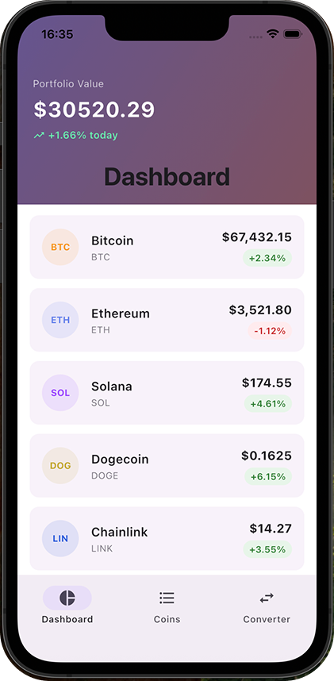
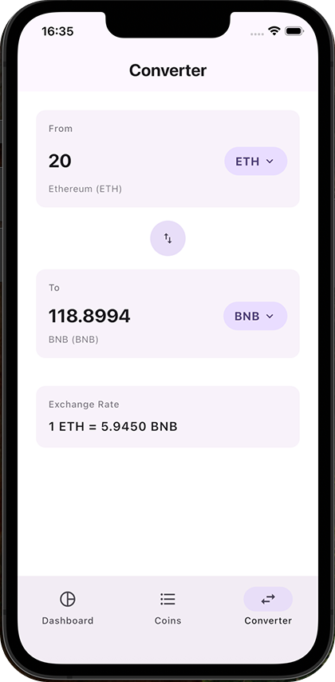
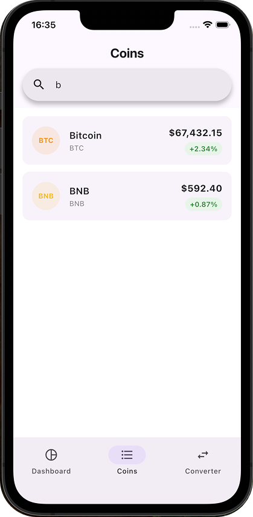

# midterm_app — Crypto Portfolio (Flutter)

A small Flutter demo app that displays a mock cryptocurrency portfolio, a coins list with search, a converter between currencies/cryptos and USD, and detailed views for each cryptocurrency. Built with Material 3 theming and a simple in-repo mock dataset.

---

## Quick summary
- App name (UI): Crypto Portfolio
- Platform: Flutter (mobile — Android/iOS)
- Entry point: `lib/main.dart`
- Main screens: Dashboard (Portfolio), Coins list (search + details), Converter
- Data: in-repo mock data in `lib/data/crypto_data.dart` (no external API required)

---
## App Screens

  
  
  

## Features
- Dashboard showing portfolio overview (pre-populated holdings)
- Coins list with instant search by name or symbol
- Coin detail screen with price, 24h change, market stats, and holding value when applicable
- Converter to convert between cryptos and USD, with selectable currencies and a swap action
- Material 3 theming (light/dark) and reusable UI cards/widgets
- All data is mocked locally for offline/demo use

---

## What’s included (key files)
- `lib/main.dart` — app entry, MaterialApp, theme configuration
- `lib/screens/home_screen.dart` — bottom navigation and main screen switching
- `lib/screens/portfolio_screen.dart` — portfolio/dashboard (shows holdings)
- `lib/screens/coins_list_screen.dart` — searchable list of mock cryptos
- `lib/screens/crypto_detail_screen.dart` — detailed crypto view and holding value
- `lib/screens/converter_screen.dart` — currency/crypto converter UI and logic
- `lib/data/crypto_data.dart` — `mockCryptos` list and `portfolioHoldings` map (sample data)
- `lib/models/crypto.dart` — crypto model (type definitions)
- `lib/utils/format_utils.dart` — helpers for formatting prices and large numbers
- `lib/widgets/` — shared UI components (e.g., list tiles)

---

## Project structure
/
- lib/
  - data/ (mock data)
    - crypto_data.dart
  - models/
    - crypto.dart
  - screens/
    - home_screen.dart
    - portfolio_screen.dart
    - coins_list_screen.dart
    - converter_screen.dart
    - crypto_detail_screen.dart
  - utils/
    - format_utils.dart
  - widgets/
    - crypto_list_tile.dart
  - main.dart
- pubspec.yaml
- test/ (empty or test files)

---

## Running the app (development)
Prerequisites:
- Flutter SDK (matching `environment.sdk` in `pubspec.yaml`; this repo targets Dart/Flutter SDK >= 3)
- A connected device or emulator (Android/iOS) or a desktop target if configured

Typical steps:
1. Clone the repo:
   git clone https://github.com/ninikurshavishvili/midterm_app.git
2. Install dependencies:
   flutter pub get
3. Run the app:
   flutter run

To run on a specific device or emulator, use `flutter devices` to list and `flutter run -d <device-id>`.

---

## How the app works (implementation notes)
- The app uses local mock data in `lib/data/crypto_data.dart`. `mockCryptos` contains sample cryptocurrencies with price, market cap, 24h change, and color values. `portfolioHoldings` maps crypto id -> quantity owned.
- Home navigation is implemented with a bottom NavigationBar (`home_screen.dart`) that switches between:
  - Portfolio (dashboard)
  - Coins list (search + tap to open details)
  - Converter (pick currencies, enter amount, swap)
- Coins list filtering is done locally by matching the query against name or symbol.
- Converter uses a USD sentinel id (`__usd__`) so conversions can be done crypto-to-crypto or crypto-to-USD using the static `price` values.
- Detail screens use `format_utils.dart` to format currency and large numbers for display.

---

